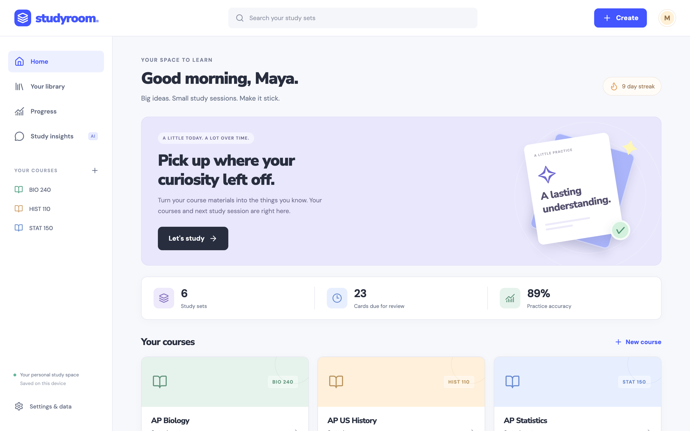
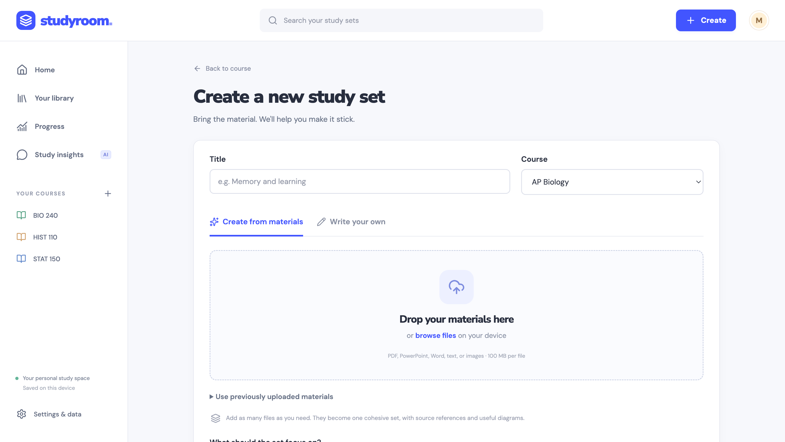
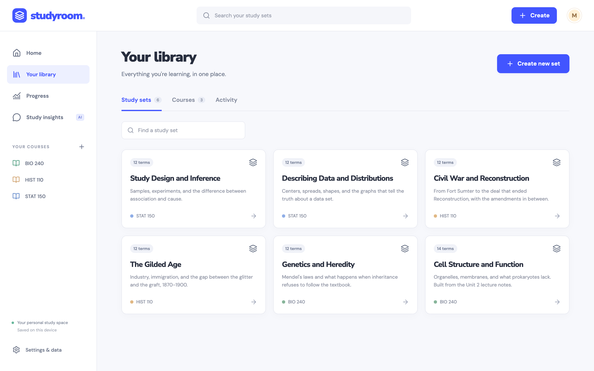
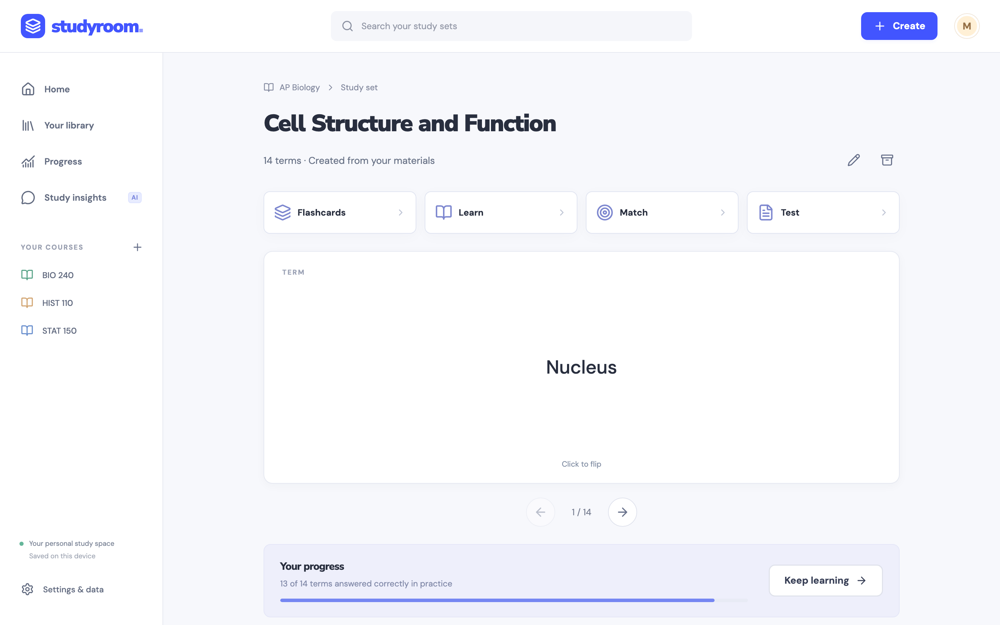
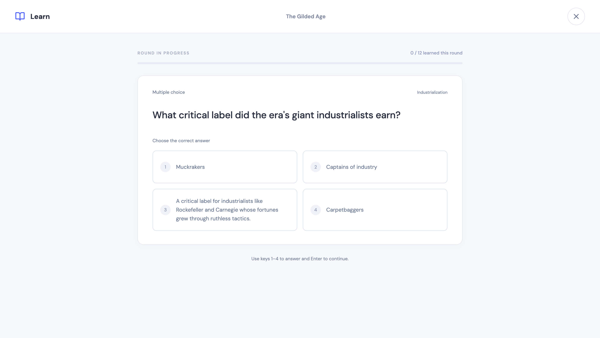
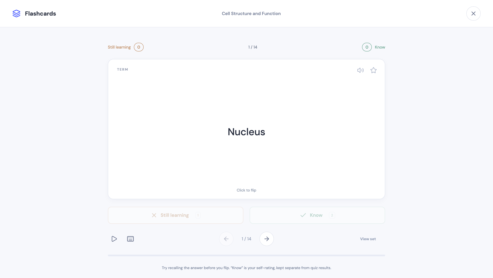
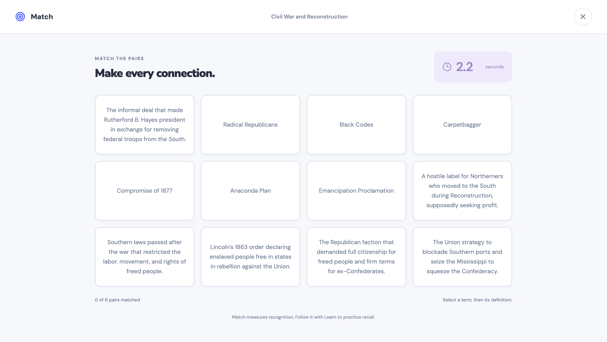
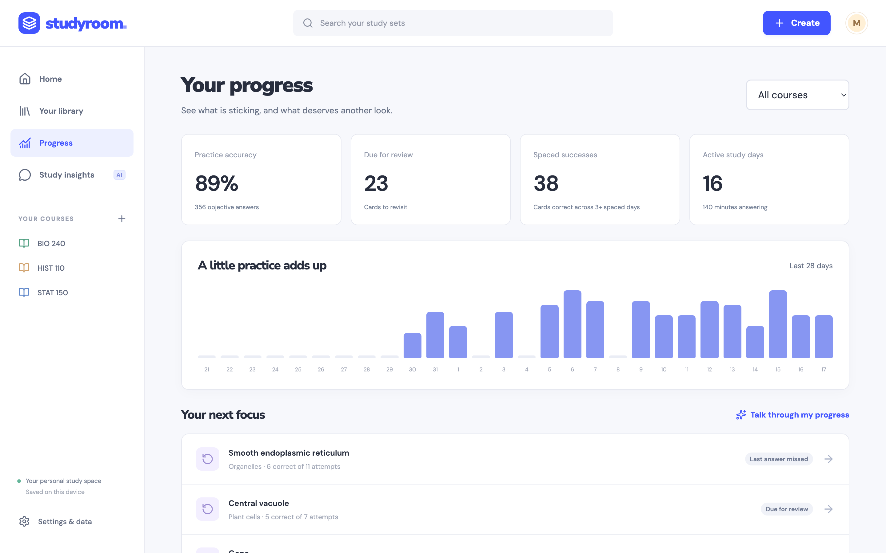
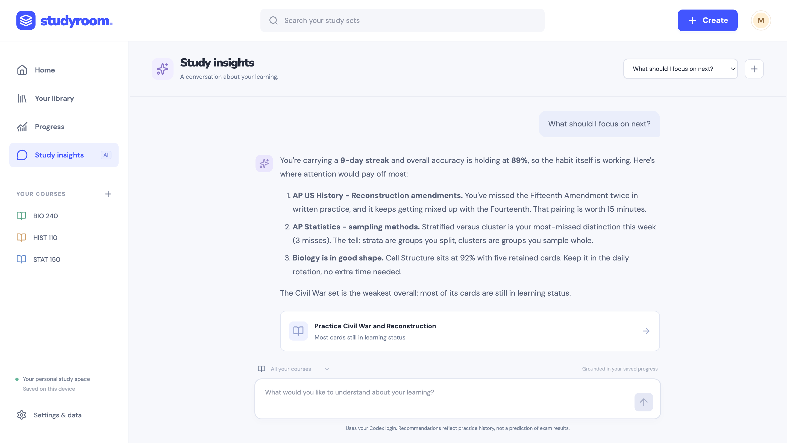

<div align="center">
  

  <h3>Your materials, made to stick.</h3>

  <p>
    <strong>Studyroom is a forever-free, local-first Quizlet alternative.</strong><br />
    Drop in any course material. Your own AI subscription builds a complete study set from it.
    You practice with Flashcards, Learn, Match, and Tests. AI shows you what is sticking,
    what is fading, and exactly what to practice next.
  </p>

  <a href="#quick-start">Get started</a> ·
  <a href="#screenshots">Screenshots</a> ·
  <a href="#docs">Docs</a> ·
  <a href="https://github.com/AdamHAwad/studyroom/issues">Report a bug</a>

  <br /><br />

  
  
  
  
  <a href="LICENSE"></a>

  <br /><br />

  
</div>

## What is Studyroom?

Studyroom is an open-source study app that runs entirely on your own computer. You give it your course materials. Lecture slides, PDFs, textbook scans, Word docs, handwritten notes, whatever you have. It turns them into a full Quizlet-style study set: terms, definitions, multiple-choice questions with plausible distractors, topic grouping, and explanations. Every generated card cites its source, so you can click through to the exact line of your material it came from.

You then study the way you already know how. Flashcards for recall, Learn for adaptive rounds that keep retrying what you missed, a timed Match game, and configurable Tests. As you practice, Studyroom records objective answers and spaced successes. Ask its AI coach a question and it reads your real progress data, tells you what needs work, and hands you links straight to the practice. Every answer comes with evidence from your own attempts, so the advice is about your studying, not generic tips.

Everything runs locally except the AI calls. The app itself is a local web server with a SQLite database, no account, no telemetry, no cloud. The AI steps use the account you already pay for, Codex (ChatGPT) by default or OpenCode as an option. No API keys, no extra subscription, no per-set fees. Quizlet Plus charges monthly for this; Studyroom uses what you already have.

## Why Studyroom

- **Forever free.** No account, no paywall, no ad tiers. The only cost is the AI subscription you already have, and only when you generate or ask.
- **Cards grounded in your materials.** Generated cards must cite exact source excerpts or diagrams from your uploads. Provenance is checked automatically.
- **Four real study modes.** Flashcards, Learn, Match, and Test, with starred terms, audio, keyboard play, and saved in-progress sessions.
- **Metrics you can trust.** Practice accuracy counts objective answers only. Self-ratings never inflate it. Retained status is a documented heuristic, inspectable in the open code.
- **An AI coach that knows your data.** Study insights chat answers with evidence from your actual attempts and links to the exact set, card, or mode you need.
- **Your data stays yours.** One SQLite file on your machine. JSONL export, daily backups, and a settings-page export button, all built in.

## Quick start

Have your agent of choice (Codex, OpenCode, Claude Code, Cursor, or any coding agent) do it for you. Copy this prompt:

```text
Install and run Studyroom on this machine.

1. git clone https://github.com/AdamHAwad/studyroom ~/studyroom
2. cd ~/studyroom && npm install && npm run build
3. npm start
4. If poppler is missing, install it with the system package manager so PDF uploads work
5. Open it in my default browser

Leave the app running for me.
```

That is the whole install. The agent clones the repo, builds it, starts the server, and opens the app.

## Manual install

You need Node 26 or newer and npm.

```sh
git clone https://github.com/AdamHAwad/studyroom
cd studyroom
npm install
npm run build
npm start
```

Open http://localhost:3210. To make it start at login and restart on crashes:

```sh
npm run install-startup
```

Optional, for reading uploads. Without them you can still upload text, Markdown, DOCX, and PPTX. Install with your system's package manager (commands per system are in [docs/operations.md](docs/operations.md)):

- **poppler** for PDF text and page images
- **LibreOffice** for DOCX and PPTX page rendering
- **Python 3 with PyMuPDF** for PDF diagram page selection

Want to look around before uploading anything? Seed a scratch copy with sample courses and study history:

```sh
STUDYROOM_DATA=~/studyroom-demo npx tsx scripts/seed-demo.ts
STUDYROOM_DATA=~/studyroom-demo npm start
```

## Screenshots

<div align="center">

| | |
|:---:|:---:|
| **Turn any materials into a set** | **Your course library** |
|  |  |
| **Four study modes on every set** | **Adaptive Learn rounds with feedback** |
|  |  |
| **Flashcards** | **Match, timed recognition** |
|  |  |
| **Progress that separates fact from guesswork** | **AI insights over your real study data** |
|  |  |

</div>

## How the AI works

Studyroom does not call an AI API. It launches the agent CLI already signed in on your machine, Codex by default or OpenCode from Settings, in a read-only sandbox with a strict JSON contract. Set generation runs in small concurrent batches with saved checkpoints, so a long upload that fails partway resumes where it left off instead of starting over. A review pass checks the merged draft for material errors, coverage gaps, and diagrams that would leak answers before the set publishes.

The same harness powers Study insights. Chat requests send a bounded snapshot of your progress, not your whole library, and the reply must cite IDs that exist in the snapshot it was given. Every job keeps a receipt in `data/jobs`, including the model, effort, and duration used.

Studying itself needs no network at all. Practice, scheduling, tests, and exports all work offline.

## Privacy and your data

- One SQLite file under `data/` holds everything: courses, cards, attempts, sources, jobs, chats.
- The app binds to `127.0.0.1` only. Nothing is sent anywhere except the agent calls you trigger.
- Deleting a course or set archives it. Nothing self-destructs, and daily backups live in `data/backups`.
- Full JSON export and per-table JSONL export live in Settings and `npm run data -- export`.

## Docs

- [System and agent contracts](docs/architecture.md)
- [Operations, backups, and recovery](docs/operations.md)
- [Research and design decisions](docs/research.md)
- [Contributing](CONTRIBUTING.md)

## Built with

React 19, TypeScript, Vite, Express 5, SQLite (node:sqlite), Radix UI, Motion, Lucide, KaTeX, React Markdown, Sonner, DM Sans, and Nunito Sans. Agent work runs through Codex CLI or OpenCode. No Docker, no database server, no analytics SDK.

## Star history

If Studyroom saved you from a paywall or helped you pass something, please give it a star. It is the only thing that keeps this visible to other students.

<div align="center">
  <a href="https://star-history.com/#AdamHAwad/studyroom&Date">
    <picture>
      <source media="(prefers-dark-scheme)" srcset="https://api.star-history.com/svg?repos=AdamHAwad/studyroom&type=Date&theme=dark" />
      <source media="(prefers-light-scheme)" srcset="https://api.star-history.com/svg?repos=AdamHAwad/studyroom&type=Date" />
      
    </picture>
  </a>
</div>

## Credits

- The agents that turn your materials into study sets and insights follow the [unslop skill](https://github.com/cursor/plugins/blob/main/pstack/skills/unslop/SKILL.md), which keeps their writing plain, specific, and human.
- Icons come from [Lucide](https://lucide.dev); typefaces are [DM Sans](https://fonts.google.com/specimen/DM+Sans) and [Nunito Sans](https://fonts.google.com/specimen/Nunito+Sans). The full dependency list is in [package.json](package.json).

## License

[MIT](LICENSE). Quizlet is a trademark of Quizlet, Inc., and this project is not affiliated with or endorsed by it. The name, design, and code are original.
